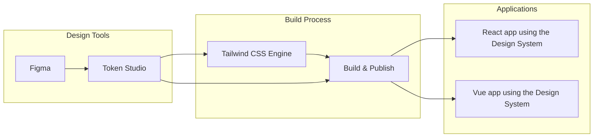
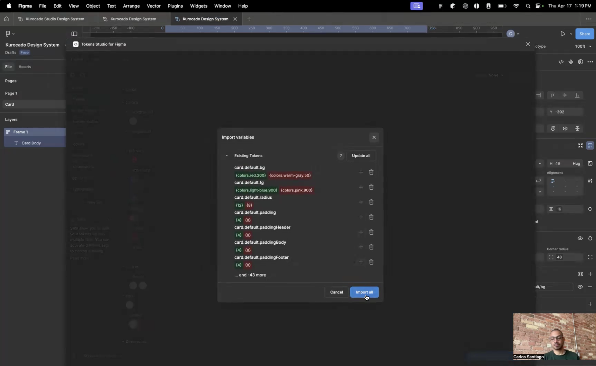

# Kurocado Studio Design System

A token‑driven UI library whose look & feel can be tweaked in Figma and—via Token Studio—propagated
to React and Vue components, guaranteeing pixel‑perfect brand consistency without hand‑off friction.

Kurocado Studio’s Design System delivers a single source of truth for typography, color, spacing,
and interaction patterns across web and mobile products. Designers iterate visually in Figma; Token
Studio syncs the updated design tokens to the codebase, and Storybook reflects the changes
instantly—so product teams ship new features faster while staying perfectly on‑brand.

## High Level Overview



## Quick Demo

[](https://youtu.be/RBpAYT4iMuU)

## New Project Setup

The quickest and easiest way to start using the Kurocado Studio Design System is with our
[Product Starter Kit](https://github.com/Kurocado-Studio/product-starter-kit). It’s a fully wired-up
boilerplate that includes everything you need to hit the ground running—design tokens, Tailwind
config, Storybook setup, and more.

## Documentation

For more information about this Design System’s objectives, features, and success criteria, see the
[Design System Overview](https://kurocado-studio.github.io/platform/design-system.html).

---

## Prerequisites

- **Node.js v20 or higher**  
  [Download Node.js](https://nodejs.org/)

- **PNPM**  
  [PNPM Installation Guide](https://pnpm.io/installation)  
  You can install PNPM globally with:
  ```bash
  npm install -g pnpm
  ```

---

## Getting Started

1. **Clone the repository**:

   ```bash
   git clone https://github.com/Kurocado-Studio/design-system.git
   cd design-system
   ```

2. **Install dependencies**:

   ```bash
   pnpm install
   ```

3. **Initial setup**:
   ```bash
   pnpm run setup
   ```
   This command will install all required packages and run any setup scripts.

---

## Local Development

Depending on your monorepo structure, you might have commands for running a docs site or component
playground. Common scripts include:

- **Start development server** (e.g., Storybook):
  ```bash
  pnpm run dev
  ```
- **Build all packages**:
  ```bash
  pnpm run build
  ```
- **Run tests**:
  ```bash
  pnpm run test
  ```
- **Lint code**:
  ```bash
  pnpm run lint
  ```
