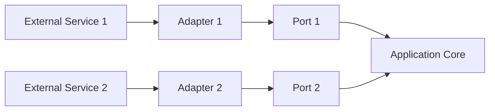

Certainly! Let's delve deeper into each section of the Ports and Adapters architecture, using the TODO app as an example, and include more diagrams and flowcharts for better understanding.

### 1. Ports and Adapters Architecture Overview

#### Core Concept:
- **Ports**: Interfaces that define the boundaries between the application and external services or user interfaces.
- **Adapters**: Implementations of these interfaces to interact with different external services or user interfaces.

#### Diagram:

This diagram shows how the external services interact with the application core through ports and adapters.

### 2. Example: TODO App

#### Core Domain Logic:
- Operations like creating, updating, and deleting TODO items.

#### Detailed Explanation:
1. **ITodoRepository (Secondary Port)**:
    - This interface abstracts the data persistence layer.
    - Methods like `add`, `remove`, `update`, and `getAll` define how the application interacts with the database.

2. **ITodoService (Primary Port)**:
    - This interface abstracts the application's core services.
    - Methods like `createTodo` and `deleteTodo` define the business logic for handling TODO items.

#### Ports and Adapters Diagram:
```mermaid
graph TD
    subgraph Application Core
        Service[ITodoService<br>(Primary Port)]
        Repository[ITodoRepository<br>(Secondary Port)]
    end
    DatabaseAdapter[SQL Database Adapter<br>(Adapter for ITodoRepository)] --> Repository
    RestController[REST Controller<br>(Adapter for ITodoService)] --> Service
    Database[(Database)] --> DatabaseAdapter
    UserInterface[User Interface] --> RestController
```
This diagram shows the TODO app's ports and adapters, illustrating how the user interface and database interact with the application core.

### 3. Implementing Core Logic and Adapters

#### Core Logic:
- **TodoService**:
    - Implements `ITodoService`.
    - Contains the business logic for managing TODO items.

#### Adapters:
- **SqlTodoRepository**:
    - Implements `ITodoRepository`.
    - Handles data persistence in a SQL database.

- **RestTodoController**:
    - Serves as an adapter for `ITodoService`.
    - Exposes REST API endpoints for the frontend.

#### Flowchart for Creating a TODO:
```mermaid
flowchart TD
    A[User creates TODO via UI] --> B[REST Controller]
    B --> C[TodoService.createTodo()]
    C -->|Calls| D[SqlTodoRepository.add()]
    D -->|Persist in DB| E[(Database)]
    E -->|Return result| C
    C -->|Response| B
    B -->|Show to user| A
```
This flowchart depicts the process of creating a TODO item, from the user interface to the database.

### 4. Applying SOLID Principles

- **Single Responsibility**: Each class has only one reason to change (e.g., `TodoService` for business logic, `SqlTodoRepository` for database interaction).
- **Open/Closed**: New adapters can be added without modifying existing code.
- **Liskov Substitution**: Adapters can be replaced with others adhering to the same interface.
- **Interface Segregation**: Interfaces are specific to their roles (`ITodoService` for service operations, `ITodoRepository` for data operations).
- **Dependency Inversion**: High-level modules depend on abstractions (interfaces), not on concretions (specific implementations).

### Overall, this approach:
1. Decouples core logic from external concerns.
2. Facilitates easier testing and maintenance.
3. Allows flexibility in changing or adding new technologies (like different databases or UI frameworks) without impacting core business logic.